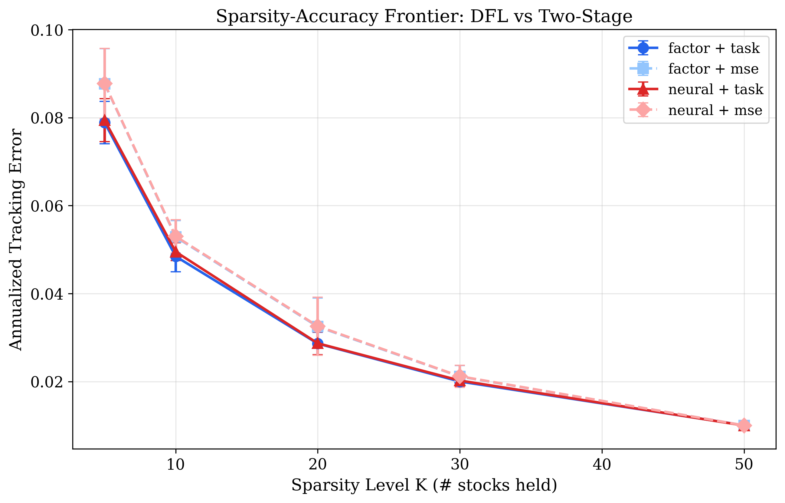

# Sparse Index Tracking via Decision-Focused Learning

End-to-end learning framework for sparse index tracking that trains covariance prediction models by directly minimizing portfolio tracking error through a differentiable optimization layer.

**CSCI 619 Course Project** — Aojie Yuan, Haiyue Zhang

## Key Idea

Traditional sparse index tracking uses a **two-stage** pipeline: (1) estimate the covariance matrix, (2) solve a quadratic program (QP) to find optimal portfolio weights. The covariance model is trained with MSE loss, which doesn't account for how estimation errors affect the downstream portfolio decision.

We replace MSE with a **task loss (Decision-Focused Learning)**: the covariance estimate is passed through a differentiable QP layer, and the model is trained to minimize the realized tracking error of the resulting portfolio. This aligns the prediction objective with the actual decision task.

<p align="center">
  
</p>

## Results

Evaluated on **97 S&P 500 stocks** over **9 rolling folds** (2009–2025), the neural + DFL approach achieves statistically significant tracking error reduction at low sparsity levels — precisely where stock selection is hardest:

| K (# stocks) | Neural+DFL | Neural+MSE | Improvement | p-value |
|:---:|:---:|:---:|:---:|:---:|
| 5 | 7.94% | 8.77% | **-9.5%** | 0.001*** |
| 10 | 4.95% | 5.30% | **-6.6%** | 0.012** |
| 20 | 2.87% | 3.26% | **-11.9%** | 0.025** |
| 30 | 2.02% | 2.12% | **-4.5%** | 0.135 |
| 50 | 1.00% | 1.00% | -0.2% | 0.150 |

DFL wins **9/9 folds** at K=5, 10, 20. The advantage diminishes at higher K where sufficient stocks make covariance estimation less critical.

## Method

```
Features → Covariance Model → Differentiable QP Layer → Portfolio Weights → Task Loss
              (learnable)         (unrolled PGD)           (sparse)        (realized TE)
                  ↑                                                             |
                  └─────────────── end-to-end gradients ────────────────────────┘
```

**Two-phase QP formulation:**
1. **Stock selection**: Pick top-K stocks by market-cap weight from the predicted covariance
2. **Reduced QP**: Solve a K-dimensional QP to minimize tracking error against the full index

**Training**: Unrolled projected gradient descent (100 iterations + Duchi simplex projection) provides strong gradient flow. Evaluation uses exact QP via [cvxpylayers](https://github.com/cvxgrp/cvxpylayers).

## Architecture

| Component | Description |
|---|---|
| **Factor Model** | Low-rank covariance: `Σ = BΛB' + D` (10 factors) |
| **Neural Model** | MLP → low-rank factors + diagonal (rank-20, [256,128] hidden) |
| **QP Layer** | Unrolled PGD (train) / cvxpylayers (eval) |
| **Task Loss** | `L = 252 × mean((r_portfolio - r_index)²)` |

## Project Structure

```
├── configs/default.yaml          # Hydra config (model, training, optimization)
├── src/
│   ├── data/                     # S&P 500 loader, features, rolling splitter
│   ├── models/                   # Factor and neural covariance models
│   ├── optimization/
│   │   ├── qp_layer.py           # Differentiable QP (unrolled + cvxpylayers)
│   │   └── solver.py             # Standalone QP solver (evaluation)
│   ├── training/
│   │   ├── losses.py             # MSE and task (DFL) loss functions
│   │   └── trainer.py            # Training loop with gradient accumulation
│   ├── evaluation/               # Tracking error, turnover, IR metrics
│   └── main.py                   # Experiment runner
├── scripts/generate_figures.py   # Publication figures + statistical tests
├── figures/                      # Generated plots (PDF + PNG)
└── results/                      # Experiment results (JSON)
```

## Quick Start

```bash
# Install
pip install -e .

# Run experiments (4 configurations)
python -m src.main model.name=neural training.loss=task    # Neural + DFL
python -m src.main model.name=neural training.loss=mse     # Neural + MSE
python -m src.main model.name=factor training.loss=task    # Factor + DFL
python -m src.main model.name=factor training.loss=mse     # Factor + MSE

# Generate figures and statistical analysis
python scripts/generate_figures.py
```

Override any config via CLI:
```bash
python -m src.main training.lr=3e-4 optimization.sparsity_levels=[5,10,20] training.epochs=100
```

## Figures

| Figure | Description |
|---|---|
| `fig1_sparsity_frontier` | Tracking error vs sparsity level K (main result) |
| `fig2_turnover_frontier` | Portfolio turnover vs K |
| `fig3_te_boxplot_K20` | TE distribution across 9 folds at K=20 |
| `fig4_dfl_advantage` | Heatmap: % TE reduction by model × K |
| `fig5_cumulative_tracking_K20` | Cumulative portfolio return vs index |
| `fig6_turnover_ablation` | Turnover penalty (λ) ablation study |

## Requirements

- Python ≥ 3.10
- PyTorch ≥ 2.2
- cvxpy + cvxpylayers
- See `pyproject.toml` for full list
